 

 

 

L2TPvpn service construction and data capture, analysis and static load replacement based on ubuntu operating system

# Introduction

## Experimental Requirements

Based on C++ Design and implement a simple system to achieve:

1. Crawl l2tp protocol Traffic based on windows7 or linux.

2. For each Target User, monitor its l2tp requests in real time and analyze, restore, and present its connections and business payloads.

3. Support payload replacement for specific targets.

Build a demo: Use a laptop to achieve the above functions of surfing the Internet on a mobile phone.

## Design Introduction

Layer 2 tunneling protocol (English: Layer Two Tunneling Protocol, abbreviated as L2TP) is a virtual tunneling protocol commonly used in virtual private networks. The L2TP protocol itself does not provide encryption and reliability verification functions, and can be used with security protocols to achieve encrypted data transmission. The encryption protocol often used with the L2TP protocol is IPsec, and when these two protocols are used together, they are usually collectively referred to as L2TP/IPsec.

This experiment is based on the Linux Kernel Ubuntu operating system to build L2TP-VPN, data transmission and device communication under the L2TP virtual network; using C language based on libpcap library files to achieve L2TP data packet capture, specific Target User filtering, data packet analysis; based on netfilter library for L2TP data packet static load replacement.

For the first question, we refer to L2TP.sh script to build L2TP service on Ubuntu 16.04 operating system, use libpcap library for L2TP data packet capture, in the loop_pcap core Function to achieve the presentation of L2TP data Message, on the basis of the corresponding analysis of each data packet hexadecimal Message content, which belongs to the extracted L2TP Message payload information.

For the second question, based on the L2TP Message payload information, for different Target Users, we independently write pcapsetfilter Function in the "IP layer", " UDP layer", "L2TP version", "L2TP tunnel" four levels to filter the Target User; on the basis of filter filtering, we further analyze the extracted L2TP Message payload information, and achieve the extraction implementation of the L2TP Message payload through the underlying binary processing methods such as bit and shift. Finally, the business load analysis of "single target and L2TP server" interaction and "multi-target data interaction" are analyzed respectively.

For the third question, we use the netfilter open source library to achieve the use of the Linux Kernel module Netfilter hook in the network segment of the L2TP connection network connection UDP Message, and modify some of the data. First, deploy the L2TP server mount hook program, grab the udp Message, and use Client_1 to simulate the UDP protocol to Client_2 code packet of the released version. Second, L2TP sever hook Message, modify Message, forward Message, Client_2 receive message, and view the changed payload information.

# Environment configuration

### Network topology

The real network is provided by ios15 (172.20.10.1) as a web server to ensure that the L2TP server, Client 1, and Client 2 are under the same 172.20.10 network segment for L2TP connection.

172.20.10.1——ios15，web server

172.20.10.4——ubuntu-16.04，L2TP server

172.20.10.3——windows10，Client_1（Rabbit）

172.20.10.5——windows10，Client_2（Cat）

 

Figure 1 Overall architecture of network topology

### Environment construction

#### Configure L2TP server

We use the shell scripting language to build L2TP-vpn on the ububtu operating system. First, refer to the github repository https://github.com/makedary/across.git Cloud as a Service build VPN the writing method, build L2TP.sh to build ubuntu virtual L2TP service.

Permission and execution through the chmod command, the deployment information and results are shown in the following figure (the main information is the virtual network segment - 192.168.18 network segment, used to build L2TP services):

 

After the build is successful, use the l2tp -a command to add users. Create two users here, the usernames are "cat" and "rabbit", which are the most Client_1 and Client_2 required for this experiment. The user list is shown in the figure below:

 

#### Add user connection

We first try to connect to the L2TP server with the "rabbit" account, and the connection result is shown in the figure below:

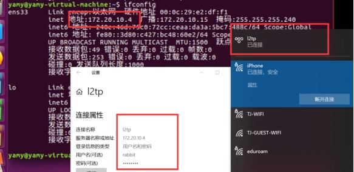 

Subsequently, the "rabbit" account checks the network configuration in the ipconfig in the machine, and you can see that the ip address of its L2TP service is 192.168.18.2, under the 192.168.18 network segment built.

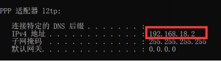 

Check the configuration of the L2TP server (ubuntu virtual machine ). At this time, the virtual IP address of the L2TP server is 192.168.18.1, and the IP address of the point-to-point connection (the L2TP connection under the rabbit account in the picture above) is 192.168.18.2.

 

#### Verify user connection

In order to verify whether the network connection is successful, try to send and receive data packets between the connector and the service party to verify whether the L2TP service is successfully established:

 

We try to use the L2TP server and the "Rabbit" account machine to send ping requests to each other. It can be seen from the results above that the two can receive and send data packets to each other, and the connection is successful.

#### Build a complete L2TP topology network structure

We use the same method to connect Client_2 ("cat" account):

 

It can be observed that the new 192.168.18.3 point connection, comprising Client_1 (192.168.18.2) and Client_2 (192.168.18.3) in the configuration of both the connection configuration.

 

We try to send data packets between Client_1 and Client_2 under L2TP service.

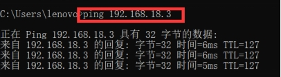 

It can be seen that the two can send and successfully receive data packets to each other under the 192.168.18 network segment.

## L2TP capture and its business load analysis

### Open Source Library Selection

First we need to be based on linux gcc The open source library libpcap for packet capture, presentation and presentation. Libpcap is a network data packet capture Function library, and tcpdump under Linux is based on it. However, because the level of libpcap is the application layer, it can only monitor the Traffic itself and cannot replace, modify and forward the data in it. Therefore, in the process of solving questions 1 and 2, the libpcap library can be used to implement.

### Traffic analysis method

After obtaining the data packet through libpcap, we need to analyze the content of the hexadecimal data packet itself, find the location of the corresponding L2TP in the data packet, and analyze the protocol Traffic of the L2TP itself.

L2TP Message header format:

 

Figure 2 L2TP Message format

According to the above content, we need to use the "pointer" to extract, analyze and process the data packet part of the L2TP Message on the basis of the captured data; use the method of "bit and" and "shift" to extract the data of the specific bit of L2TP. The specific content to be extracted is shown in the following figure:

Type (T): identifies the type of message, 0 is a data message, 1 is a control message.

Length (L): When set to 1, it means that the value of the Length field exists, and the L bit of the control message must be set to 1.

X bit: reserved bits, all reserved bits are set to 0.

Sequence (S): When set to 1, it means that Ns and Nr exist, and must be set to 1 for the control message S.

Offset ( O ): set to 1, indicating Offset Size field exists, for the control message O must be set to 0.

Priority (P): Only for data messages, for control message P position 0, when data message this position 1, indicating that the message should be prioritized in this queue and transmission.

Ver: Must be 2, indicating the version of the L2TP data header.

Length: Identifies the length (in bytes) of the entire Message.

Tunnel ID: Identifies the L2TP control link. The L2TP Tunnel identifier has only local meaning. The ID allocated at both ends of a Tunnel may be different. The Tunnel in the header refers to the recipient's Tunnel ID, not the sender's. The local Tunnel ID allocated when the Tunnel is created. Through Tunnel ID AVPs and peers exchange Tunnel ID information.

Session ID: Identifies a session in the tunnel, only local meaning, a session at both ends ID may be different.

Ns: Identifies the sequence number to send data or control messages, starting at 0, incrementing by 1, to 216 and starting at 0.

Nr: Identifies the next expected control message. The value of Nr is set to Ns + 1 of the previous received control message. This is an acknowledgment of the previous received control message. Data messages ignore Nr.

Offset Size: Identifies the offset of the payload data, if the value exists.

### code implementation

We capture the content of the L2TP data protocol through libpcap data packet. The overall code flow is shown in the figure below:

 

Figure 3 L2TP capture overall code flow

 

It can be seen from the above figure that the network segment to be captured is first passed in through the main Function parameter (ens33 here). Secondly, the L2TP server passes the ip and mask of the corresponding machine into the pcap_lookupnet for capture; the pcap_create generates the pcap capture pointer and structure, and uses pcap_compile Compilation to capture and execute the corresponding capture statement. Through the "pcap_setfilter" filter out "1701 udp port" (udp port opened by L2TP) to resolve the corresponding traffic load. Finally, all preprocessing information is given to the pcap_loop on the left to perform the capture of the core l2tp data packet.

Based on the above content, we need to build my_package_handler core parsing Function, which parses, analyzes and renders L2TP data based on the real-time capture of l2tp data packets. my_package_handler implements the following core functions:

#### data packet filtering

According to the requirements of the topic, we need to eliminate the data packet that does not meet the requirements and parse the data packet that meets the requirements. We filter based on different levels of data packet, progressive layer by layer, and continuous refinement:

 

1. IPV4 Ethernet layer screening

When the received data packet is non-ip data packet, send a prompt message and filter:

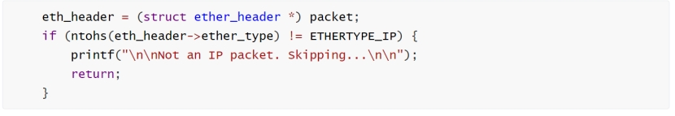 

2, UDP layer screening

Since the UDP UDP protocol content is the data segment referred to by a 9-byte pointer with an offset headed by ip_header, it is judged whether it is a UDP protocol according to the protocol number, and filtered if it is a non-UDP protocol:

 

3. L2TP protocol number screening

When the l2tp protocol does not meet the requirements, filter the corresponding L2TP data packet:

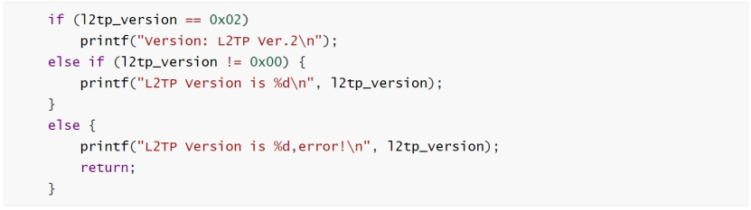 

 

Traffic load analysis

After we determine that the Message is an L2TP data packet and contains L2TP data packet information, we can determine the L2TP data offset position according to the space occupied and length of the Upper Level Protocol Message:

 

According to the L2TP Message structure mentioned in the analysis, we further refine the L2TP Message according to its bit-level offset, and extract the load information involved in the L2TP Message included in the figure below by using "bit and" according to each bit of information:

 

Fig. 5 Refined L2TP Message structure and load extraction mode diagram

####Business load extraction

Combined with the above load pattern diagram, we define the following variables to store its business load information:

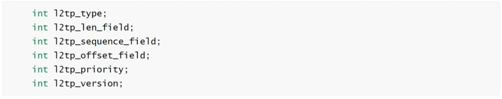 

The positions of different load information in the packet are extracted through "bit and" and "shift":

 

Determine the total length and offset of the l2tp data packet by combining the 2-3 bytes of the l2tp header information:

 

Combined with the 4-7 bytes of the l2tp header information to determine the tunnel number and session_id:

 

Combined with the 8-12 bytes of information in the l2tp header, it is determined that Ns (the sequence number identifying the sent data or control message) and Nr (the sequence number identifying the next expected received control message)

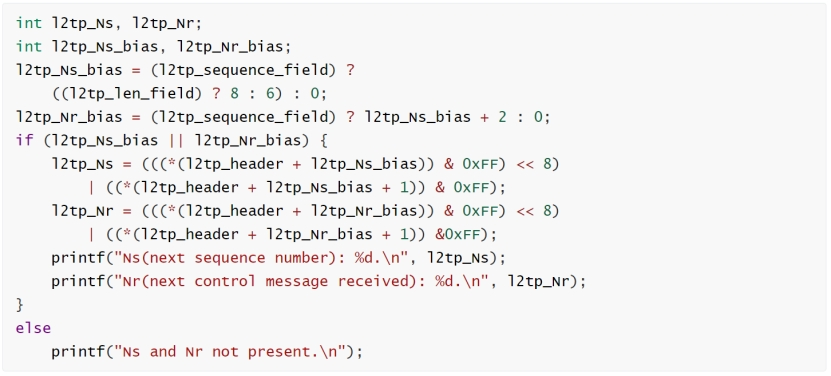 

### Realize effect display

#### L2TP packet filtering and payload capture analysis

In the process of this effect display, it simulates the process of Client_1 using L2TP service to access the Internet. As can be seen from the figure, first run the pre-Compilation mycap.sh script file and start capturing on the 192.168.18.1 network segment:

 

For each packet captured, filter for IP information, UDP information, L2TP information:

1. Filter according to whether it contains L2TP packets, and filter the data packets with L2TP protocol errors:

 

Figure 6 Non-IP packets as conditional filtering

 

Figure 7 L2TP packets as conditional filtering

Filter according to the tunnel_id of L2TP, filter the data packet that the tunnel is not successfully established

 

The filtered valid L2TP data packet is presented as follows:

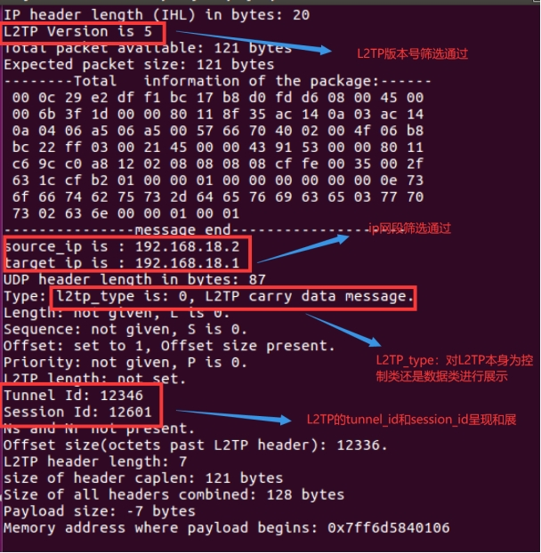 

Figure shows the capture and analysis results for the L2TP Message, since the data into the more part of the load field for analysis, the L2TP Message protocol version number is 5, source_ip, target_ip are involved in this experiment Client_1 and L2TP_server IP address, as can be seen from the Type field L2TP protocol number is 0, indicating that it carries data information rather than control information; tunnel_id and session_id used to distinguish different users.

#### Multi-objective information interaction business analysis

On the basis of the above, we add a new user Client_2 (L2TP virtual IP is 192.168.18.3), and on this basis, analyze the information of Client_1, Client_2 and L2TP servers and the mutual communication between them, as well as the information of mutual communication between Client_1 and Client_2, and analyze the traffic load information of L2TP communication under multi-target at one time.

 

The above diagram shows the interaction between Client_1 (192.168.18.2) and Client_2 (192.168.18.3) and the Host: L2TP server (192.168.18.1) respectively. The two have different Tunnel_id and session_id to distinguish the access of different users.

The left figure shows the information interaction content between Client_1 and Host: L2TP server:. The l2tp Message type == 0 presented in the log analyzes the number of "control" signals transmitted by the L2TP data packet, unnel_id and session_id are 49267 and 60558 respectively. The right figure shows the information interaction content between Client_2 and Host: L2TP server:; the l2tp Message type == 0 shows that the L2TP data packet transmits "data" information; the unnel_id and session_id are 49267 and 60558 respectively.

In addition to the communication between different users and the Host (L2TP server), we also need to examine the signal communication between different Client_1 and Client_2.

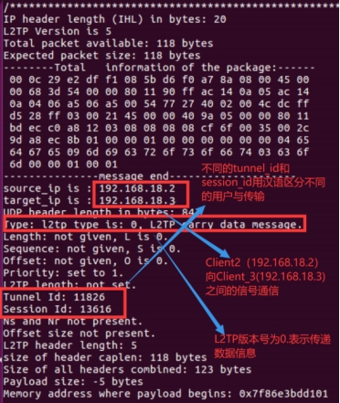 

Signal communication between the captured Client_1 (192.168.18.2) to Client_2 (192.168.18.3). source_id address == 192.168.18.2 in the left figure indicates that the original IP address of the captured sender is 192.168.18.2; target_id address == 192.168.18.3 in the right figure indicates that the target IP is Client_2 (192.168.18.2), indicating that Client_2 sends information to Client_1.

Both interactive content, respectively, with different tunnel_id and session_id when communicating with both the l2tp server; L2tp category number is 0, indicating that the captured data is transmitted between the Client_1 and Client_2.

## Implementation of target-specific payload replacement

### Open Source Library Selection

Because the libpcap library referenced in question 1 and 2 is at the application layer, it cannot replace, modify and forward the data in the link layer. Therefore, the implementation of question 3 is based on Netfilter in the Linux Kernel module to achieve payload replacement.

Netfilter is a Message processing (filtering or modifying) framework integrated into the Linux Kernel Network Protocol Stack. It is a subsystem of the linux Kernel. Netfilter adopts Modularization design and has good extensibility. Its important tool module, IPTables, is connected from the iptables of User Mode to the Netfilter of Kernel Mode. Netfilter and IP Protocol Stack are seamlessly integrated, and allow users to filter, address translation, processing and other operations on datagrams.

### Experiment target

In the L2TP connection, use Linux kernel module Netfilter hook UDP Message, and modify some of the data.

 

### Experiment flow

1. L2TP sever mount hook program, grab UDP Message.

2. Open Client_1, L2TP sever, Client_2 wireshark for traffic capture.

3. Client_1 use python to simulate UDP protocol to Client_2 code packet of the released version.

4. L2TP sever hook Message, modify Message, forward Message.

5. Client_2 receive messages

### Experimental process

### Client_1 data packet UDP data packet

Using python to simulate UDP data packet, UDP packet data content is "cat lend rabbit 5000 dollars" code is as follows:

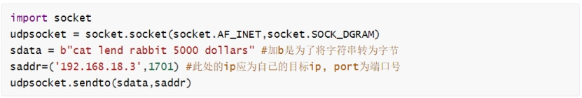 

#### L2TP sever modify Message

##### hook Message

The Message is intercepted using the Hook Function in the Linux Kernel module Netfilter, and its fields are printed to the log. Here we only capture the packets with specific content sent Client_1 UDP packets.

 

The following figure shows the effect of extracting Message achieved by the above code, where data [0-7] = cat lend, indicating that in kernel mode, we caught a specific data packet, and can show the basic information of the data packet.

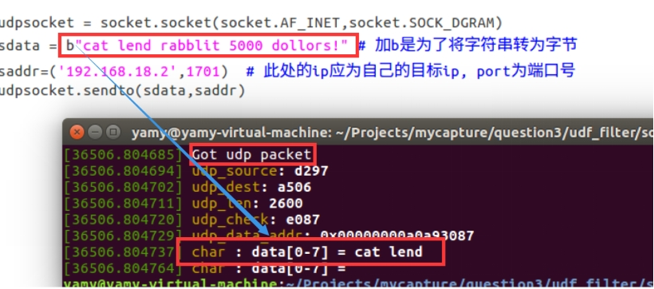 

#### Modify Message

In the previous step, you can already Hook to the Message, and now you can modify its content. Through conditional judgment, find the protocol packet sent for the Client_1, and then modify the UDP Message data through pointer operation, changing "cat lend rabbit 5000 dollars" to "dog lend rabbit 5000 dollars". UDP The protocol packet is sent for the .

 

##### defined by the udphdr structure UDP header, as follows:

In linux/udp.h udphdr structure:

 

##### struct udphdr source c code:

#####  

#####Get the starting address of the data

The hook function of netfilter captures the data packet at PREROUTING, moves the pointer to the first address of the data segment, and replaces the data in linux Kernel Mode.

 

##### Recalculate checksum

After modifying the data of the data packet, the most important thing is to calculate the UDP The checksum is calculated. There is a corresponding Function in the Kernel, but it is necessary to understand the meaning of each parameter when calling. In particular, pay attention to the calculation result to reverse the checksum and keep it consistent with Netfilter.

UDP Calculating the checksum is similar to calculating the checksum of IP datagram header, but the difference is that IP datagram checksum only checks IP the header of the datagram, but UDP checksum checks both the header and the data part together.

On the sender side, first put all zeros into the checksum field. Then the pseudo header and UDP User datagram are made up of many 16-bit strings. If the data part of the UDP user datagram is not an even number of bytes, fill in an all-zero byte (the last odd byte should be the 16-bit high byte and the low byte should be 0, this byte is not sent). Then the sum of these 16-bit words is calculated according to the binary inverse. After writing the binary inverse of this sum to the checksum field, send this UDP user datagram. 

### Realize effect display

#### Client_1

In Client_1 wireshark intercepted 2 types of Traffic packets, the intercepted packets are:

A data packet Client_1 (192.168.18.2) to Client_2 (192.168.18.3) with the data part "cat lend rabbit 5000 dollars".

The data packet sent by the agent (114.87.232.108) to the Client_2 (192.168.18.3) with the data part "dog lend rabbit 5000 dollars".

Where ip is 114.87.232.108 is the gateway address of ios15 (Web Sever), the L2TPserver proxy uses the gateway to send the intercepted data packet.

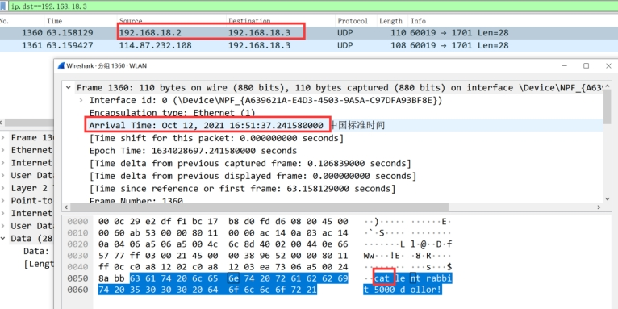 

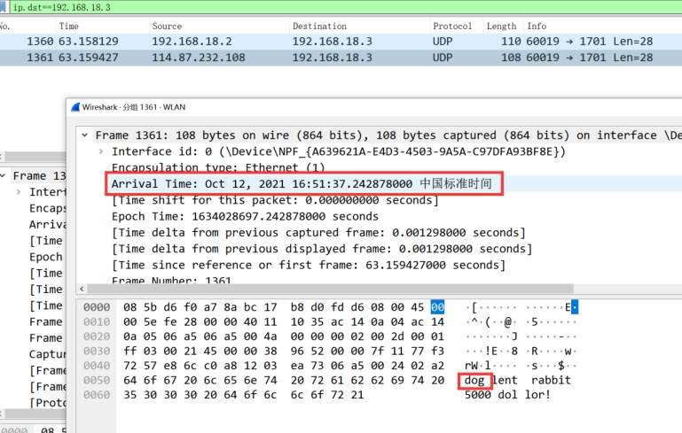 

From this result, it can be seen that the packet originally sent by Client_1 (192.168.18.2) is "cat", and after modification by the L2TP server udp The change of the content of the Message from "cat" to "dog" can preliminarily indicate that the modification is successful, but whether it is successful "intercepted" and "modified forwarding" needs to wait until the data packet capture on the L2TP sever and Client2 ends for further verification.

#### L2TP sever

In L2TP wireshark intercepts two types of traffic packets: traffic packets (originally "cat") sent by Client_1 (192.168.18.2) to Client_2 (192.168.18.3), and traffic packets (modified to "dog") sent by L2TP server proxy (114.87.232.108) to Client_2 (192.168.18.3).

 

It can be clearly seen from wireshark that the packet sent by Client_1 is modified by L2TP sever, and the correctness of the payload replacement result is verified.

#### Client_2

In Client_2 wireshark intercepted only 1 Traffic packet, and the intercepted packets are:

The data packet sent by the agent to the Client_2 (192.168.18.3), the data part of which is "dog lend rabbit 5000 dollars".

 

In the end, only one data packet is received, and its content is changed from "cat" to "dog", which shows that "interception" is successful and "modification and forwarding" is successful.

In summary, the Client_1 initiated by the L2TP server intercepts and modifies its udp udp data segment, modifies the internal data from cat to dog, and replaces the content by the L2TP server and sends it to the Client_2. After being captured by wireshark, the successful payload replacement is verified.

## Problems encountered in the process and solutions

1. Under L2TP connection, Client_1 can ping Client_2, Client_2 cannot ping Client_1.

 

Cause: L2TP sever will automatically assign a virtual address from the address pool. In our example, the virtual address is 192.168.18.xxx. After the remote dial L2TP is successful, the gateway allocated by L2TP sever will replace the original gateway and become the new default gateway. Client_1 does not use the gateway allocated by L2TP in the actual operation process, so Client_1 can access the extranet, but cannot access the intranet under L2TP, so it cannot reply to Client_2.

**Solution:**

Under Windows: Open Network Adapter Options, select L2TP's VPN , select Properties, Internet Protocol 2 Version, Properties, Advanced, and check Use Default Gateway on Remote Networks.

 

Figure 10 Connection VPN After the machine can not access the Internet solution

From the above, we need to restore the L2TP gateway (the first command), and then let the route to the remote network go from the virtual address allocated by the L2TP sever (the second command). Finally, the problem is successfully resolved.

2. Because Netfilter is running in Kernel Mode instead of User Mode, the debugging difficulty escalates. The system Kernel reports the error "The guest operating system is disabled CPU , please shut down or restart the virtual machine ".

 

Reason: When capturing and modifying a Message, the restriction is too broad, and only the protocol is UDP , which causes the data content of some UDP other packages containing important information to be changed, causing the operating system to crash.

Solution: In the original protocol for UDP for the restriction, add the restriction data [0:3] == 'cat'.

3. On the basis of 2, when running the Netfilter mounted Kernel code, L2TP cannot connect.

Reason: Through the "dmesg -wH" command to monitor the Kernel status in real time, it is found that Client_1 the Kernel status changes when connecting to L2TP sever. The L2TP packet can not connect without confirming that there is no error. I thought of the reason explained by the teacher in class, so I guessed that it is related to the running speed. After commenting part of the code of Netfilter, it is found that L2TP can connect, which verifies the conjecture.

Solution: Add judgment conditions, and directly filter data packets that do not meet the solution conditions in 2.

# 6 Summary

Through this experiment, we have a deeper understanding of the internal structure and operating mechanism of L2TP. It stimulates us to learn the linux Kernel in depth for the first time and understand the mechanism running in the kernel mode. At the same time, it is also the first time to learn how to use Message capture, which solidifies the use of C++ the lowest-level method to achieve Message content extraction and analysis. C++ Message capture

In the process of environment construction, we tried to use windows10, windowsXP virtual machine , windows10-wsl (windows built-in linux kernel), centos6 Cloud as a Service server , all failed, and finally chose linux-16.04 as our L2TP server. In the process of trying, we borrowed some shell scripts, and at the same time modified the shell scripts for the problems of linux-16.04 to run and deploy successfully.

In the process of Message capture and modification, we first tried the libpcap packet for capture and interception, but since in the early stage of the experiment we only focused on the convenient nature of libpcap in packet interception and use, but ignored the application layer, the analysis level of libpcap, and could not go deep into the link layer to modify the data packet being transmitted. Therefore, in the later stage, the netfilter package is used as the main framework and runs in the linux Kernel to modify the data packet.

In the process of implementing the third question, interception, replacement, and forwarding, we found that modifying the data packet incorrectly or forwarding the data packet too slowly will cause the operating system to crash or fail to connect. Because the script runs in kernel mode, according to the existing operating system knowledge, once an error occurs in the script running in kernel mode, the break is irreversible. We have also experienced numerous shutdowns and restarts in the process of trying, and finally found the correct method to modify the data packet, achieving the replacement, modification, frame verification, forwarding of the data packet, and the other party successfully received the modified Message content.

In the follow-up information security principles and information security direction of the learning process, will further enhance their ability to deal with security issues, make good use of more software analysis, processing and other methods to solve the problem, so as to further enhance their ability to deal with information security issues.

## References

Li Xianjun, Zhang Shaofang, Li Yan. L2TP-based remote access VPN implementation [J]. Computer Knowledge and Technology, 2019,15 (22): 50-52.

[2] Ni Jie, Xu Zhiwei, Li Hongzhi. PPTP VPN Implementation and security testing VPN with L2TP/IPSec [J]. Electronic Technology and Software Engineering, 2019 (12): 192.

[3]https://www.netfilter.org/

[4] Linux network programming - libpcap detailed explanation [https://zhuanlan.zhihu.com/p/145094996

[5] Principle and use of libpcap [https://blog.csdn.net/ptmozhu/article/details/78743126]

[6] [layer 2 tunneling protocol - wiki Baike , free Baike Encyclopedia (wikipedia.org) ] (https://zh.wikipedia.org/wiki/ layer 2 tunneling protocol)

[7] [Netfilter - HOOK mechanism in Netfilter] (https://blog.csdn.net/windeal3203/article/details/51204911) [https://blog.csdn.net/windeal3203/article/details/51204911]

[8] [L2TP under Ubuntu] (https://blog.51cto.com/spencergra/1921627) [https://blog.51cto.com/spencergra/1921627]

 