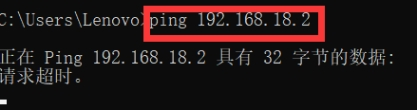

 

 

 

基于ubuntu操作系统的L2TPvpn服务搭建及数据捕获、分析、静载荷替换

[摘要	](#_Toc13149 )

[1 实验要求	](#_Toc16082 )

[2 环境配置	](#_Toc32613 )

[2.1 网络拓扑结构	](#_Toc8391 )

[2.2 环境搭建	](#_Toc12165 )

[3 L2TP捕获及其业务载荷分析	](#_Toc5645 )

[3.1 开源库选择	](#_Toc10203 )

[3.2 流量分析方法	](#_Toc26930 )

[3.3 代码实现	](#_Toc11288 )

[3.4 实现效果展示	](#_Toc19729 )

[4 特定目标净载荷替换的实现	](#_Toc29147 )

[4.1 开源库选择	](#_Toc24145 )

[4.2 实验目标	](#_Toc29344 )

[4.3 实验流程	](#_Toc10766 )

[4.4 实验过程	](#_Toc25187 )

[4.5 实现效果展示	](#_Toc10872 )

[5 过程中所遇到的问题及解决方法	](#_Toc6188 )

[6 总结与体会	](#_Toc29097 )

[参考文献	](#_Toc24600 )

# Introduction

## 实验要求

基于C++设计并实现一个简单系统，实现：

1. 基于windows7或linux抓取l2tp协议流量。

2. 针对每一个目标用户，实时监控其l2tp请求并分析、还原、呈现其连接和业务载荷。

3. 支持对特定目标的净载荷替换。

构建一个demo:用笔记本电脑实现对手机上网对象的以上功能。

## 设计简介

第二层隧道协议（英语：Layer Two Tunneling Protocol，缩写为L2TP）是一种虚拟隧道协议，通常用于虚拟专用网。L2TP协议自身不提供加密与可靠性验证的功能，可以和安全协议搭配使用，从而实现数据的加密传输。经常与L2TP协议搭配的加密协议是IPsec，当这两个协议搭配使用时，通常合称L2TP/IPsec。

本实验基于linux内核的Ubuntu操作系统进行L2TP-VPN的搭建，在L2TP虚拟网络下进行数据的传输，设备通信；采用C语言基于libpcap库文件实现L2TP数据包的捕获，特定目标用户的过滤，数据包分析；基于netfilter库进行L2TP数据包静载荷替换。

针对第一问，我们参考L2TP.sh脚本在Ubuntu16.04操作系统上搭建L2TP服务，采用libpcap库用于L2TP数据包的捕获，在loop_pcap核心函数当中实现对L2TP数据报文的呈现，在此基础上分别分析对应每个数据包16进制报文内容，提取出其中其中属于L2TP报文载荷信息。

针对第二问，我们在L2TP报文载荷信息的基础上，针对于不同的目标用户，自主编写pcapsetfilter函数在“IP层”、“UDP层”、“L2TP version”、“L2TP tunnel”四个层级到对于目标用户的过滤；在过滤器过滤的基础上，我们对提取出的L2TP报文载荷信息进一步进行分析，通过底层位与、移位等二进制处理方式达成对于L2TP报文载荷的提取实现。最后分别分析“单目标与L2TP服务机”交互，与“多目标间数据交互”的业务载荷分析。

针对第三问，我们使用netfilter开源库，达成在L2TP连接网络连接网段内，利用Linux内核模块Netfilter hook UDP报文，并对其中的部分数据进行修改。首先部署L2TP 服务机挂载hook程序，抓取udp报文，用Client_1利用python模拟UDP协议给Client_2发包。其次L2TP sever hook报文、修改报文、转发报文，Client_2接收消息，并查看所更改的载荷信息。

# 环境配置

### 网络拓扑结构

真实网络由ios15（172.20.10.1）作为web服务器提供网络，保证L2TP 服务器、客户端1号，客户端2号处在同一172.20.10网段下，以进行L2TP连接。

172.20.10.1——ios15，web server

172.20.10.4——ubuntu-16.04，L2TP server

172.20.10.3——windows10，Client_1（Rabbit）

172.20.10.5——windows10，Client_2（Cat）

 

图 1 网络拓扑结构整体架构

### 环境搭建

#### 配置L2TP服务器

我们通过shell脚本语言，在ububtu操作系统上进行L2TP-vpn的搭建。首先参考github仓库https://github.com/makedary/across.git中云服务器搭建VPN的书写的方法，构建L2TP.sh以搭建ubuntu虚拟L2TP服务。

通过chmod命令予以权限并执行，部署信息和结果如下图所示（主要信息为虚拟网段——192.168.18网段，用于搭建L2TP服务）：

 

构建成功之后，采用l2tp -a命令即可增加用户，此处建立两个用户，用户名分别为“cat”和“rabbit”最为本次实验所需要的Client_1和Client_2。用户列表如下图所示：

 

#### 增加用户连接

我们首先采用“rabbit”账号尝试连接L2TP服务器，连接结果如下图所示：

 

随后，“rabbit”账号在本机中的ipconfig当中查看网络配置情况，可以看到其L2TP服务所处在的ip地址为192.168.18.2，在所搭建的192.168.18网段下。

 

查看L2TP服务器（ubuntu虚拟机）中的相关配置情况，此时L2TP服务器的虚拟ip地址为192.168.18.1，点对点连接（上图所属的rabbit账号下的L2TP连接）ip地址为192.168.18.2。

 

#### 验证用户连接

为了验证网络连接是否成功，尝试连接方与服务方收发数据包看接收和相应情况来验证L2TP服务是否搭建成功：

 

我们尝试用L2TP server与“Rabbit”账户机相互发送ping请求，由上图结果可知两者间能相互接收和发送数据包，连接成功。

#### 构建完整L2TP拓扑网络结构

我们采用相同的方法对于Client_2（“cat”账户）进行连接：

 

可以观察到新增了192.168.18.3的点对点连接，在配置中包含有Client_1 (192.168.18.2)以及Client_2(192.168.18.3)两者的配置连接。

 

我们尝试在L2TP服务下，使用Client_1 与 Client_2相互发送数据包

 

可见两两之间在192.168.18网段下能够相互发送并成功接收数据包。

## L2TP捕获及其业务载荷分析

### 开源库选择

首先我们需要基于linux gcc开源库libpcap进行包的抓取，呈现和展示。libpcap 是一个网络数据包捕获函数库，Linux下的tcpdump即以之为基础。然而由于libpcap所处在的层级为应用层，只能对于流量本身进行监控而无法对其中的数据进行替换、修改和转发。因此在解决1，2问的过程中可以使用到libpcap库来进行实现。

### 流量分析方法

通过libpcap获取得到数据包之后，我们需要对于16进制数据包本身的内容进行分析，找到对应L2TP所处在数据包中的位置，并对于L2TP本身的协议流量进行分析。

L2TP报文头格式：

 

图 2 L2TP报文格式

根据上述内容，我们需要在捕获到数据的基础上，采用“指针”，对于L2TP报文的数据包部分分析进行提取、分析和处理；采用“位与”、“移位”的方法对于L2TP特定的位的数据进行提取，具体需要提取的内容如下图所示：

Type(T)：标识消息的类型，0表示是数据消息，1表示控制消息。

Length(L)：置1时，说明Length域的值是存在的，对于控制消息L位必须置1。

X bit：保留位，所有保留位均置0。

Sequence(S)：置1时，说明Ns和Nr是存在的，对于控制消息S必须置1。

Offset(O)：置1时，说明Offset Size域是存在的，对于控制消息O必须置0。

Priority(P)：只用于数据消息，对于控制消息P位置0，当数据消息此位置1时，说明该消息在本列队和传输时应得到优先处理。

Ver：必须是2，表示L2TP数据报头的版本。

Length：标识整个报文的长度(以字节为单位)。 

Tunnel ID：标识L2TP控制链接，L2TP Tunnel标识符只有本地意义，一个Tunnel两端被分配的Tunnel ID可能会不同，报头中的Tunnel是指接收方的Tunnel ID，而不是发送方的。本端的Tunnel ID在创建Tunnel时分配。通过Tunnel ID AVPs和对端交换Tunnel ID信息。

Session ID：标识Tunnel中的一个session，只有本地意义，一个session两端Session ID可能不同。

Ns：标识发送数据或控制消息的序号，从0开始，以1递增，到216再从0开始。

Nr：标识下一个期望接收到的控制消息。Nr的值设置成上一个接收到的控制消息的Ns+1。这样是对上一个接收到的控制消息的确认。数据消息忽略Nr。

Offset Size：如果值存在的话，标识有效载荷数据的偏移。

### 代码实现

我们通过libpcap数据包来进行L2TP数据协议内容的捕获，整体代码流程如下图所示：

 

图 3 L2TP捕获整体代码流程

 

由上图可知首先通过主函数参数传入所需要捕获的网段（此处为ens33），其次，L2TP server将对应机的ip和mask传入到pcap_lookupnet当中进行捕获；由pcap_create生成pcap捕获指针及结构，采用pcap_compile编译出对应的捕获执行语句。通过“pcap_setfilter”筛选出“1701号udp端口”（L2TP所开放的udp端口）从而解析对应的业务载荷。最终将所有预处理信息给到左侧的pcap_loop当中执行核心的l2tp数据包的捕获。

在上述内容的基础上，我们需要构建my_package_handler核心解析函数，在实时捕获到l2tp数据包的基础之上对于L2TP数据进行解析，分析和呈现。my_package_handler实现了如下核心功能：

#### 数据包筛选

依据题目要求，我们需要剔除不符合要求的数据包，解析符合要求的数据包，我们分别基于数据包的不同的层级进行筛选，逐层递进，不断精化：

 

1、IPV4以太网层筛选

当收到的数据包为非ip数据包是，发出提示信息并过滤：

 

2、UDP层筛选

由于udp协议内容为以ip_header为首偏移量为9字节指针所指的数据段，根据协议号判断是否为udp协议，如果是非udp协议则将其过滤：

 

3、L2TP协议编号筛选

当l2tp协议不符合要求时，将对应的L2TP数据包进行过滤：

 

 

#### 流量载荷分析

当我们确定了该报文为L2TP数据包，包含L2TP数据包信息了之后，我们可根据上层协议报文所占空间和长度确定L2TP数据偏移位置：

 

根据分析时所提到的L2TP报文结构，我们根据其bit层级的偏移量，进一步的将L2TP报文细化，依据每一位的信息采用“位与”的方式提取如下图所包括的L2TP报文所涉及的载荷信息：

 

图 5 细化L2TP报文结构及载荷提取模式图

#### 业务载荷提取

结合上述载荷模式图，我们定义如下变量以存放其业务载荷信息：

 

不同载荷信息在包中的位置，通过“位与”、“移位”提取载荷信息：

 

结合l2tp头部2-3 字节信息确定l2tp数据包总长和总偏移量：

 

结合l2tp头部4-7 字节信息确定tunnel隧道编号和session_id：

 

结合l2tp头部8-12字节信息确定Ns（标识发送数据或控制消息的序号）及Nr（标识下一个期望接收到的控制消息）

 

### 实现效果展示

#### L2TP包过滤及载荷捕获分析

在本次效果展示的过程中，模拟了Client_1借助L2TP服务上网的过程，由图可知，首先运行预先编译好的mycap.sh脚本文件，开始在192.168.18.1网段上进行捕获：

 

对于捕获到的每一个包，对于ip信息，UDP信息，L2TP信息进行过滤：

1、依据是否包含L2TP包进行过滤，将L2TP协议错误的数据包予以过滤处理：

 

图 6 非ip包作为条件过滤

 

图 7 L2TP包作为条件过滤

2、依据L2TP之tunnel_id进行过滤，将tunnel未成功建立的数据包进行过滤

 

过滤后所得到的有效L2TP数据包呈现为如下形式：

 

上图呈现出为L2TP报文的捕获和分析结果，由于数据较多进对于其中部分载荷字段进行分析，该L2TP报文协议版本号为5，source_ip、target_ip分别为本实验中涉及的Client_1和L2TP_server的ip地址，由Type字段可看出L2TP协议的编号为0，表示其携带的是数据信息而非控制信息；tunnel_id和session_id用于区别不同的用户。

#### 多目标信息交互业务分析

我们在上述基础上新增用户Client_2（l2tp虚拟ip为192.168.18.3），在此基础上分析Client_1、Client_2分别与l2tp服务器以及两者之间相互通信的信息，以及Client_1、Client_2两者之间相互通讯的信息，一次来分析多目标下的L2TP通信的业务载荷信息。

 

上图呈现的是Client_1（192.168.18.2）和Client_2（192.168.18.3）分别与Host：L2TP服务器（192.168.18.1）之间的交互内容。两者分别拥有不同Tunnel_id和session_id用以区分不同用户的访问。

左图中呈现的是Client_1与Host：L2TP服务器：的信息交互内容，在日志中所呈现的l2tp报文类别type==0分析得到该L2TP数据包传递数“控制”信号，unnel_id和session_id分别为49267与60558。右图中呈现的是Client_2与Host：L2TP服务器：的信息交互内容；l2tp报文类别type==0可知L2TP数据包传递“数据”信息；unnel_id和session_id分别为49267与60558。

除了不同用户与Host（L2TP服务器）之间的通信，我们还需要考察不同的Client_1和Client_2两者之间的信号通信。

 

上图捕获到的Client_1（192.168.18.2）向Client_2（192.168.18.3）之间的信号通讯。其中左图source_id address==192.168.18.2，表示捕获到的发送方的原ip地址为192.168.18.2；右图中target_id address==192.168.18.3，表示目标ip为Client_2（192.168.18.2），表示由Client_2向Client_1发送信息。

两者相互的交互内容，分别具有与两者向l2tp server通讯时不同的tunnel_id和session_id；L2tp类别号为0，表示捕获到Client_1与Client_2之间相互传递数据信息。

## 特定目标净载荷替换的实现

### 开源库选择

由于1、2问中所引用的libpcap库处在应用层，无法对链路层中的数据进行替换、修改和转发。因此，第三问的实现基于Linux内核模块中的Netfilter实现净载荷替换 。

Netfilter是一套融入在Linux内核网络协议栈中的报文处理(过滤或者修改)框架，是linux内核的一个子系统。Netfilter采用模块化设计，具有良好的可扩充性。其重要工具模块IPTables从用户态的iptables连接到内核态的Netfilter的架构中，Netfilter与IP协议栈是无缝契合的，并允许使用者对数据报进行过滤、地址转换、处理等操作。

### 实验目标

在L2TP连接下，利用Linux内核模块Netfilter hook UDP报文，并对其中的部分数据进行修改。

 

### 实验流程

1. L2TP sever挂载hook程序，抓取udp报文。

2. 打开Client_1、L2TP sever、Client_2的wireshark进行流量捕获。

3. Client_1利用python模拟UDP协议给Client_2发包。

4. L2TP sever hook报文、修改报文、转发报文。

5. Client_2接收消息

### 实验过程

#### Client_1发送UDP数据包

使用python模拟UDP数据包，UDP包中data内容为“cat lend rabbit 5000 dollars”代码如下：

 

#### L2TP sever修改报文

##### hook报文

利用Linux内核模块Netfilter中的Hook函数将报文截取到，并且将其各字段打印到log中。在这里我们仅仅捕获Client_1发送的含有特定内容的UDP包。

 

下图为我们通过上述代码实现的提取报文的效果展示，其中，data[0-7]=cat lend,表明在内核态下，我们抓到的特定的数据包，并能展示数据包的基本信息。

 

#### 修改报文

在上一步已经可以Hook到报文，现在可以对其内容进行修改。通过条件判断，找到为Client_1发送的UDP协议包，再通过指针操作，对UDP报文数据进行修改，将“cat lend rabbit 5000 dollars”改为“dog lend rabbit 5000 dollars”。

 

##### 通过udphdr结构体定义UDP头部，如下：

在linux/udp.h中udphdr结构：

 

##### struct udphdr源c代码：

#####  

##### 获取数据的起始地址

利用netfilter的钩子函数在PREROUTING处捕获数据包后，移动指针到data段的首地址，在linux内核态进行数据的替换。

 

##### 重新计算校验和

在修改数据包得数据之后，最主要的就是对UDP校验和得计算，内核中有相应得函数，但是调用时要明白各个参数所代表得含义。尤其要注意计算结果将校验和倒转，保持和Netfilter一致。

UDP计算校验和的方法和计算IP数据报首部校验和的方法相似。但不同的是：IP数据报的校验和只检验IP数据报的首部，但UDP的校验和是将首部和数据部分一起都检验。

在发送方，首先是将全零放入检验和字段。再将伪首部以及UDP用户数据报看是由许多16位的字串接起来。若UDP用户数据报的数据部分不是偶数个字节，则要填入一个全零字节(最后一个奇数字节应是16位数的高字节而低字节填0，此字节不发送)。 然后按二进制反码计算出这些16位字的和。 将此和的二进制反码写入校验和字段后，发送此UDP用户数据报。

### 实现效果展示

#### Client_1

在Client_1中wireshark截获到2种流量包，截获到的包有：

l Client_1(192.168.18.2)向Client_2(192.168.18.3)发送的数据包，其data部分为“cat lend rabbit 5000 dollars”。

l 代理(114.87.232.108)向Client_2(192.168.18.3)发送的数据包，其data部分为“dog lend rabbit 5000 dollars”。

其中ip为114.87.232.108的是ios15(Web sever)的网关地址，L2TPserver代理使用该网关将截获的数据包进行发送。

 

 

由该结果可看出原本由Client_1（192.168.18.2）发出的包为“cat”，而经过L2TP server修改过后udp报文的内容由“cat”转为“dog”可初步说明修改成功，但是否成功“截获”、“修改转发”需要等到L2TP sever端和Client2端数据包捕获情况进行进一步验证。

#### L2TP sever

在 L2TP 中wireshark截获到两种流量包：原本由Client_1(192.168.18.2)发送给Client_2(192.168.18.3)的流量包（原本内容为“cat”），以及从L2TP server代理(114.87.232.108)向Client_2(192.168.18.3)发送的流量包（修改后内容为“dog”）。

 

从wireshark上可以明显看到，由两种同的包内部数据的差异，可得知由Client_1发出的包被L2TP sever修改，净载荷替换结果的正确性得到了验证。

#### Client_2

在Client_2中wireshark截获到仅有1个流量包，截获到的包为：

l 代理向向Client_2(192.168.18.3)发送的数据包，其data部为“dog lend rabbit 5000 dollars”。

 

最终仅收到一个数据包，且其内容由“cat”转变为“dog”，由此可见“截获”成功并“修改转发”成功。

综上所述，由Client_1发起的报文，通过L2TP server截取、修改其udp数据段后，将内部数据由cat修改为dog后，由L2TP server替换内容后发送至Client_2。经过wireshark捕获后验证载荷替换成功的结果。

## 过程中所遇到的问题及解决方法

1. 在L2TP连接下，Client_1 能够ping通Client_2，Client_2 不能够ping通Client_1。

 

原因：L2TP sever会自动从地址池里分配虚拟地址，在我们这个实例中，虚拟地址为192.168.18.xxx。远端拨L2TP成功后，L2TP sever分配的网关会取代原来的网关，成为新的默认网关。Client_1在实际操作过程中没有使用L2TP分配的网关，因此Client_1能够访问外网，但不能够访问L2TP下的内网，因此无法回复Client_2。

解决方法：

Windows下：打开网络适配器选项，选择L2TP的vpn，依次选择属性、Internet协议2版本、属性、高级，勾选在远程网络上使用默认网关。

 

图 10 连接VPN后本机无法上网解决方法

由上述可知，需要把L2TP的网关恢复（第一条命令），再让访问远端网络的路由从L2TP sever分配的虚拟地址走（第二条命令）。最终成功解决问题。

2. 因为Netfilter是在内核态而非用户态运行的，所以调试难度升级。系统内核报错“客户机操作系统已禁用CPU，请关闭或重启虚拟机”。

 

原因：在捕获报文并修改报文时，限制条件太过宽泛，仅仅为协议为UDP时，这会导致一些包含重要信息的UDP其他包的data内容被改变，造成操作系统崩溃。

解决方法：在原有协议为UDP的限制条件下，再添加限制条件data[0:3]==’cat’。

3. 在2的基础上，运行Netfilter挂载的内核代码时，L2TP无法连接。

原因：通过“dmesg -wH”命令实时监控内核状态，发现Client_1在连接L2TP sever内核状态是变化的。L2TP包再确认没有错误的情况下无法连接，联想到老师上课讲解的原因，于是猜想和运行速度相关。将Netfilter的部分代码注释后，发现L2TP能够连接，验证了猜想。

解决方法：增加判断条件，不满足2中解决方法条件的数据包直接过滤。

## 6 总结与体会

通过本次实验，我们更加深入的了解到了L2TP内部结构和运行机制。激发我们第一次较为深入的对于linux内核进行学习，了解到在内核态下运行的机制。同时也第一次较为深入的学习到如何使用C++来进行报文的捕捉，巩固了采用C++最底层的方法实现报文内容的提取和分析。

在环境搭建的过程当中，我们尝试过使用windows10、windowsXP虚拟机、windows10-wsl（windows内置linux内核）、centos6云服务器，皆以失败告终，最终选择linux-16.04作为我们L2TP的服务器。在尝试的过程中，我们借鉴了一些shell脚本，同时针对于linux-16.04存在的问题对于shell脚本进行修改从而能够成功运行和部署。

在报文捕获和修改的过程中，我们首先尝试的是libpcap包用于捕获和截取，但是由于在实验初期我们仅仅注重于libpcap在包的截取和使用的便捷性质，却忽略了libpcap所位于分析的层级——应用层，而无法深入到链路层当中对正在传输的数据包进行修改。因此在后期采用netfilter包作为主体框架，在linux内核当中运行达到对于数据包的修改。

在实现第三问截取、替换、转发的过程当中，我们发现将数据包修改错误或者数据包转发速度过慢都会导致操作系统崩溃或者无法连接的情况。因为该脚本运行在内核态当中，根据现有操作系统的知识，一旦运行在内核态的脚本发生错误，其中断是不可逆转的。我们在尝试的过程当中也经历了无数次的关机和重启，最终找到了正确修改数据包的方法，达到了数据包的替换、修改、帧校验、转发，并且对方成功收到修改之后的报文内容。

在后续的信息安全原理和信息安全方向的学习过程当中，会进一步提升自己在安全问题处理的能力，善用更多的软件分析、处理等方法来解决问题，从而进一步提升自己在信息安全问题方面处理的能力。

## 参考文献

[1]李献军,张少芳,李岩.基于L2TP的远程访问VPN的实现[J].电脑知识与技术,2019,15(22):50-52.

[2]倪洁,徐志伟,李鸿志.PPTP VPN与L2TP/IPSec VPN的实现与安全测试[J].电子技术与软件工程,2019(12):192.

[3]https://www.netfilter.org/

[4]Linux 网络编程——libpcap详解[https://zhuanlan.zhihu.com/p/145094996

[5]libpcap原理及使用[https://blog.csdn.net/ptmozhu/article/details/78743126]

[6][第二层隧道协议 - 维基百科，自由的百科全书 (wikipedia.org)](https://zh.wikipedia.org/wiki/第二层隧道协议)

[7][Netfilter——Netfilter中的HOOK机制](https://blog.csdn.net/windeal3203/article/details/51204911)[https://blog.csdn.net/windeal3203/article/details/51204911]

[8][Ubuntu下搭建L2TP](https://blog.51cto.com/spencergra/1921627)[https://blog.51cto.com/spencergra/1921627]

 